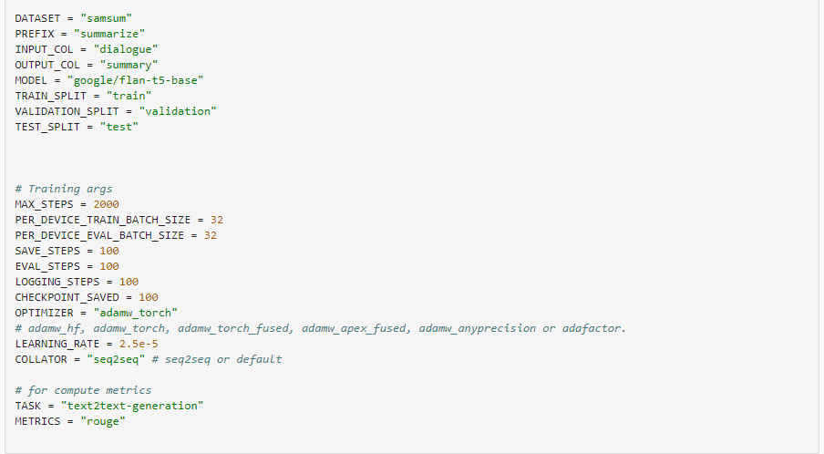

# HPC_T5

## Overview

Welcome to the T5 Transformers repository! T5, or Text-To-Text Transfer Transformer, is a powerful language model that belongs to the Transformer family. It is designed to handle various natural language processing tasks by framing them as text-to-text problems. T5 was introduced by Google Research and has proven to be highly versatile and effective in a wide range of applications.

## Environment Setup.
Required Python 3.10.12 or Higher versions.

```
git clone https://github.com/highplainscomputing/HPC_T5.git
cd HPC_T5
```
### Virtual Environment
Create a virtual environment (optional but recommended):
```bash
python -m venv myenv
```
Activate the virtual environment:
On Windows:
```bash
myvenv\Scripts\activate
```
On macOS/Linux:
```bash
source myvenv/bin/activate
```
### Requirements Installation
Install the required packages using the provided requirements.txt file:
```bash
pip install -r requirements.txt
```

### For Colab 
open following notebook in colab
get two files, download locally and upload those in your colab environment.
```
!pip install -r requirements.txt 
```
Import utility function in colab like.
```
from t5_utils import utils
```
For more info of how to use utility functions.

check out this notebook [here](https://github.com/highplainscomputing/HPC_T5/blob/main/T5/06-Text-to-sql/T5_text_to_sql.ipynb)

## What are Transformers?
Transformers are a type of neural network architecture introduced by Vaswani et al. in the paper "Attention is All You Need." They have become a fundamental building block in many state-of-the-art natural language processing models. Transformers excel in capturing long-range dependencies and contextual information, making them well-suited for tasks such as machine translation, text summarization, and language understanding.


Many tasks are cast into this framework: machine translation, classification task, regression task ( for example, predict how similar two sentences are, the similarity score is in range 1 to 5), other sequence to sequence tasks like document summarization (for example, summarising articles from CNN daily mail corpus).


## Use Cases
[T5 Transformers](https://huggingface.co/docs/transformers/model_doc/t5) can be applied to numerous natural language processing tasks, including but not limited to:

**Text Classification:** Classify documents into predefined categories.


**Text Generation:** Generate coherent and contextually relevant text.

**Named Entity Recognition (NER):** Identify and classify entities (e.g., names, 
organizations) in a text.

**Summarization:** Produce concise summaries of longer texts.

**Machine Translation:** Translate text from one language to another.

**Question Answering:** Answer questions based on a given context or passage.
Architecture

The T5 model architecture consists of an encoder-decoder framework, where both the input and output are treated as text sequences. The encoder processes the input sequence, and the decoder generates the output sequence. Attention mechanisms allow the model to focus on different parts of the input when generating the output, enabling effective handling of various language tasks.

## Fine-Tuning

Fine-tuning T5 Transformers for specific tasks involves adapting the pre-trained model on a task-specific dataset. The process generally includes the following steps:

**Data Preparation:** Organize your task-specific dataset into a format suitable for training.

**Model Initialization:** Load the pre-trained T5 model weights.

**Task-Specific Head:** Replace or add a task-specific head to the model for your particular use case.

**Training:** Fine-tune the model on your dataset using appropriate training parameters.
Additional Resources

**T5 Paper:** "Explaining and Harnessing Adversarial Examples in Image Classification" by Colin Raffel et al.

Hugging Face Transformers Library: A rich library that provides pre-trained transformer models, including T5, and tools for working with them.
TensorFlow T5 GitHub Repository: TensorFlow implementation of T5, including pre-trained models and example code.

## How to Fune Tune:
To fine your models. Like summarizations, Question Answering, Language Translation.

**The best part is you don't have to change anything except 1 cell.**



Your effort is to just replace values according to your use case. what is your Dataset name(repo id) from **huggingface**, Prefix can be a column or a pieces of text, etc.
After that you need to have a wandb account for visualization purposes.
 
Note : if you want to learn more check out huggingface docs [here](https://huggingface.co/docs/transformers/model_doc/t5) and this blog [here](https://medium.com/analytics-vidhya/t5-a-detailed-explanation-a0ac9bc53e51)

## Summary:
please check out use cases created by team [here](https://github.com/highplainscomputing/HPC_T5/tree/main/T5). You will find implementation of many use cases like [Summarization](https://github.com/highplainscomputing/HPC_T5/tree/main/T5/04-summary-generation),
[Language Translation](https://github.com/highplainscomputing/HPC_T5/tree/main/T5/02-language-translation), etc. 
Also don't forget to see [Utility Functions](https://github.com/highplainscomputing/HPC_T5/tree/main/utils).


