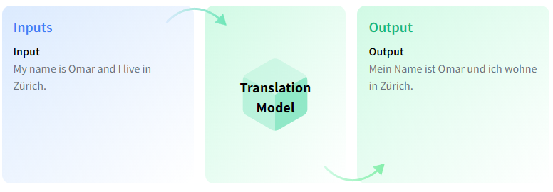
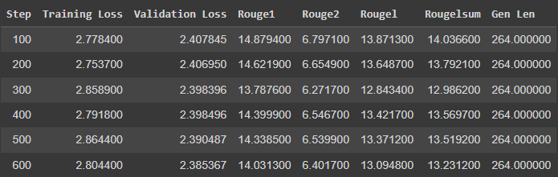
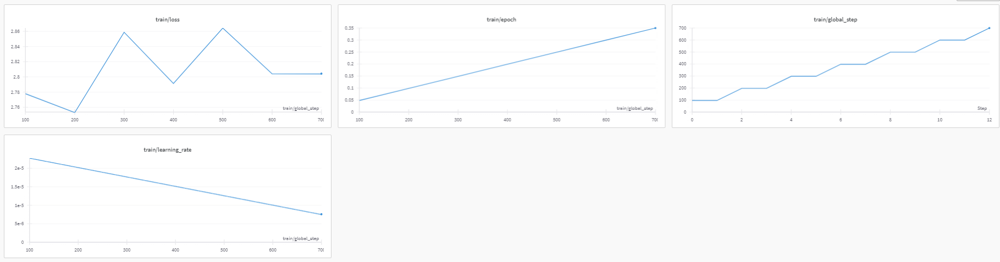
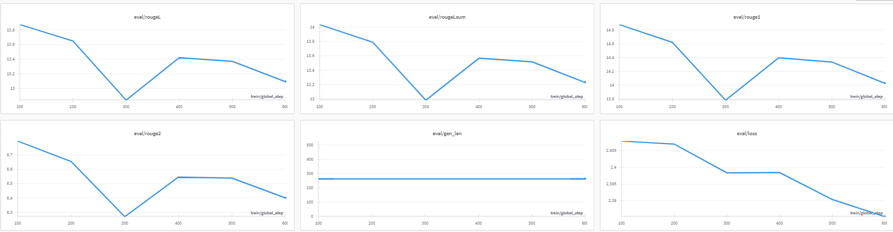

# Fine-Tuning T5 Model for Language Translation using Transformers Library

## Table of Contents

- [Overview](#Overview)
- [Prerequisites and Environment](#Prerequisites-and-Environment)
- [Data](#Data)
- [Language Translation Model](#Language-Translation-Model)
- [Visualization using WandB](#Visualization-using-WandB)
- [Training Metrics](#Training-Metrics)
- [Evaluation Metrics](#Evaluation-Metrics)
- [System Metrics](#System-Metrics)
- [Evaluation](#Evaluation)
- [Conclusion](#Conclusion)

## Overview

This code uses the Hugging Face Transformers library to fine-tune the T5 model for a **Lnaguage Translation**. The code uses the enimai/MuST-C-and-WMT16-de-en dataset, which is a popular dataset for Lnaguage Translation tasks. The code preprocesses the data, tokenizes the input and target text, and trains the model using the fine-tuning function provided by the Transformers library.

## Prerequisites and Environment

To run this code, you need to install the following libraries in colab like this:

```
!pip install accelerate -U
!pip install -q -U datasets
!pip install scipy
!pip install ipywidgets
!pip install wandb
!pip install transformers
!pip install torch
!pip install sentencepiece
!pip install tqdm
!pip install evaluate
!pip install rouge_score
!pip install huggingface_hub

```
## Data

The code uses the [enimai/MuST-C-and-WMT16-de-en dataset](https://huggingface.co/datasets/enimai/MuST-C-and-WMT16-de-en), which is a popular dataset for Language Translation tasks. The dataset consists of english text , where the translation is a segment of german text, or span, from the corresponding reading passage.

The code uses the get_data function to load and preprocess the data. The function takes the following arguments:

* dataset: The name of the dataset. In this case, it is set to "Clinton/texttosqlv2_25000_v2".
* split: The split of the dataset to load. In this case, it is set to **"train[:8000]"** for training data, **"train[8000:8900]"** for validation data, and **"test"** for test data.
The function returns a dictionary containing the input text, target text, and other metadata.

## Language Translation Model

[Language Translation (LT)](https://huggingface.co/tasks/translation) Translation is the task of converting text from one language to another.



You can find over a thousand Translation models on the Hub, but sometimes you might not find a model for the language pair you are interested in. When this happen, you can use a pretrained multilingual Translation model like mBART and further train it on your own data in a process called fine-tuning.

**Multilingual conversational agents**
Translation models can be used to build conversational agents across different languages. This can be done in two ways.

* **Translate the dataset to a new language.** You can translate a dataset of intents (inputs) and responses to the target language. You can then train a new intent classification model with this new dataset. This allows you to proofread responses in the target language and have better control of the chatbot's outputs.
* **Translate the input and output of the agent.** You can use a Translation model in user inputs so that the chatbot can process it. You can then translate the output of the chatbot into the language of the user. This approach might be less reliable as the chatbot will generate responses that were not defined before.

## Visualization using WandB

[Weights and Biases (WandB)](https://wandb.ai/) is a machine learning development platform that allows users to track and visualize various aspects of their model training process in real-time.

### Model Metrics 



### Training Metrics

During the training phase, WandB enables real-time tracking of key metrics such as loss, accuracy, and other relevant statistics. The interactive dashboard provides insights into the model's behavior over time, helping you identify trends and make informed decisions.



### Evaluation Metrics

After training, evaluate your model's performance using the evaluation metrics tracked by WandB. This includes precision, recall, F1 score, and any other task-specific metrics. Visualize the results to gain a comprehensive understanding of how well your model generalizes to unseen data.



### System Metrics

In addition to tracking model-specific metrics, WandB also captures system-level metrics. Monitor GPU/CPU usage, memory consumption, and other system-related information. This can be invaluable for optimizing your model's efficiency and ensuring smooth deployment.


## Evaluation

The code uses the ROUGE metric to evaluate the performance of the model. ROUGE is a popular metric for evaluating the quality of generated text, and it measures the overlap between the generated text and the reference text.

## Conclusion

In this code, we have shown how to fine-tune the T5 model for a **Lnaguage Translation** task using the Hugging Face Transformers library. By following the steps outlined in the code, you can fine-tune your own T5 model for a question answering task.


