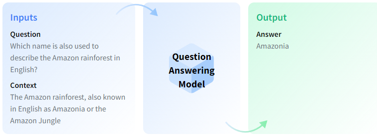
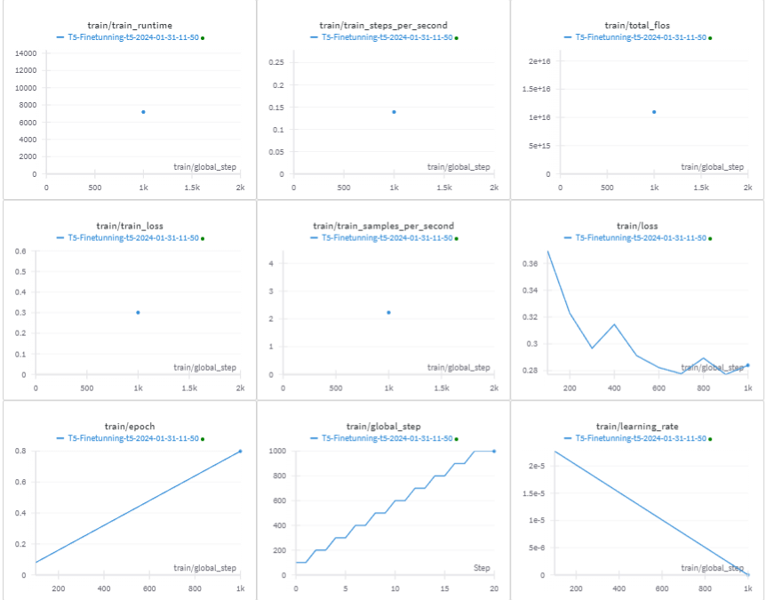
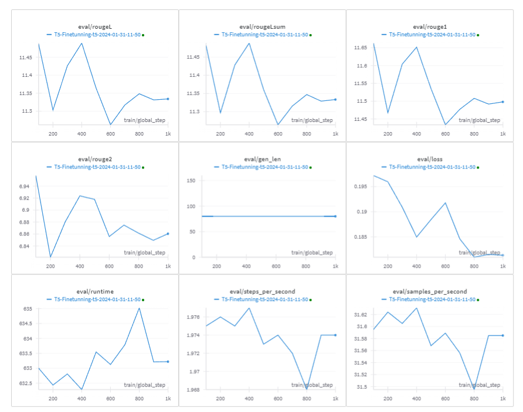
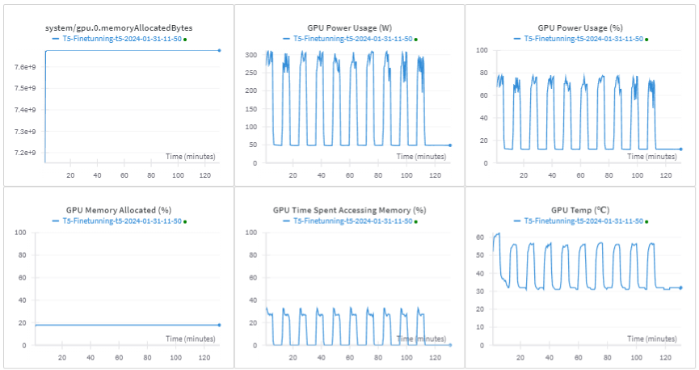

# Fine-Tuning T5 Model for Question Answering using Transformers Library

## Overview

This code uses the Hugging Face Transformers library to fine-tune the T5 model for a question answering task. The code uses the Squad dataset, which is a popular dataset for question answering tasks. The code preprocesses the data, tokenizes the input and target text, and trains the model using the fine-tuning function provided by the Transformers library.

## Prerequisites and Environment

To run this code, you need to install the following libraries in colab like this:

```
!pip install accelerate -U
!pip install -q -U datasets
!pip install scipy
!pip install ipywidgets
!pip install wandb
!pip install transformers
!pip install torch
!pip install sentencepiece
!pip install tqdm
!pip install evaluate
!pip install rouge_score
!pip install huggingface_hub

```
## Data

The code uses the Squad dataset, which is a popular dataset for question answering tasks. The dataset consists of questions posed by crowdworkers on a set of Wikipedia articles, where the answer to every question is a segment of text, or span, from the corresponding reading passage.

The code uses the get_data function to load and preprocess the data. The function takes the following arguments:

* dataset: The name of the dataset. In this case, it is set to "squad".
* split: The split of the dataset to load. In this case, it is set to "train[:20000]" for * training data, "train[20000:25000]" for validation data, and "validation[:5000]" for test data.
The function returns a dictionary containing the input text, target text, and other metadata.

## Question Answering Model

Question-Answering Models are machine or deep learning models that can answer questions given some context, and sometimes without any context (e.g. open-domain QA). They can extract answer phrases from paragraphs, paraphrase the answer generatively, or choose one option out of a list of given options, and so on. It all depends on the dataset it was trained on (e.g. SQuAD, CoQA, etc.) or the problem it was trained for, or to some extent the neural network architecture. So, for example, if you feed this paragraph (context) to your model trained to extract answer phrases from context, and ask a question like "What is a question-answering model?", it should output the first line of this paragraph.



There are different QA variants based on the inputs and outputs:

* **Extractive QA:** The model extracts the answer from a context. The context here could be a provided text, a table or even HTML! This is usually solved with BERT-like models.

* **Open Generative QA:** The model generates free text directly based on the context. You can learn more about the Text Generation task in its page.

* **Closed Generative QA:** In this case, no context is provided. The answer is completely generated by a model.

## Visualization using WandB

[Weights and Biases (WandB)](https://wandb.ai/) is a machine learning development platform that allows users to track and visualize various aspects of their model training process in real-time.

### Training Metrics

During the training phase, WandB enables real-time tracking of key metrics such as loss, accuracy, and other relevant statistics. The interactive dashboard provides insights into the model's behavior over time, helping you identify trends and make informed decisions.



### Evaluation Metrics

After training, evaluate your model's performance using the evaluation metrics tracked by WandB. This includes precision, recall, F1 score, and any other task-specific metrics. Visualize the results to gain a comprehensive understanding of how well your model generalizes to unseen data.



### System Metrics

In addition to tracking model-specific metrics, WandB also captures system-level metrics. Monitor GPU/CPU usage, memory consumption, and other system-related information. This can be invaluable for optimizing your model's efficiency and ensuring smooth deployment.



## Evaluation

The code uses the ROUGE metric to evaluate the performance of the model. ROUGE is a popular metric for evaluating the quality of generated text, and it measures the overlap between the generated text and the reference text.

## Conclusion

In this code, we have shown how to fine-tune the T5 model for a question answering task using the Hugging Face Transformers library. By following the steps outlined in the code, you can fine-tune your own T5 model for a question answering task.


